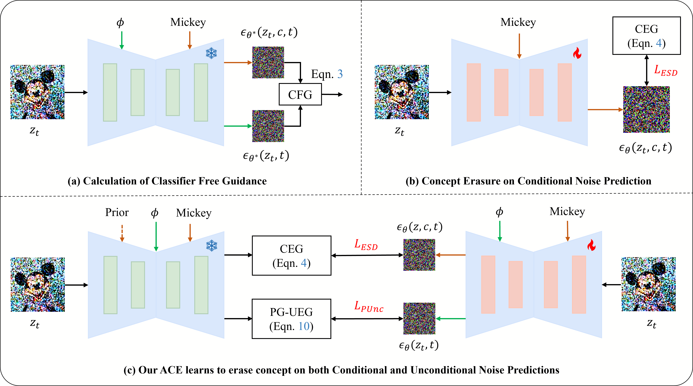
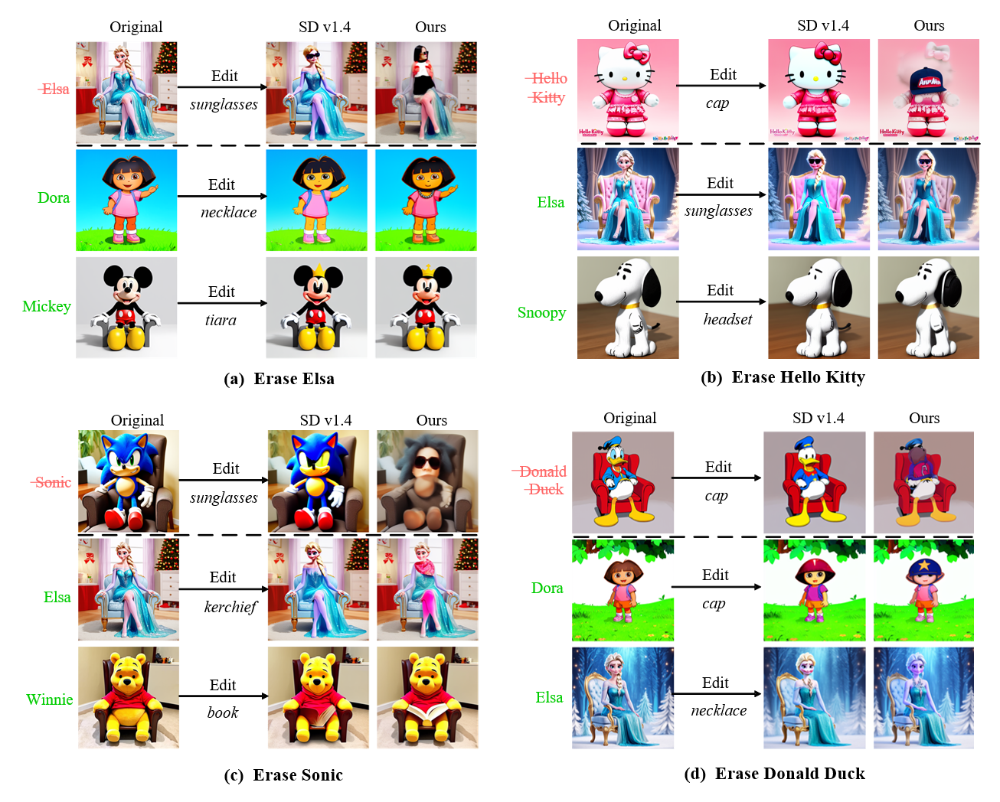
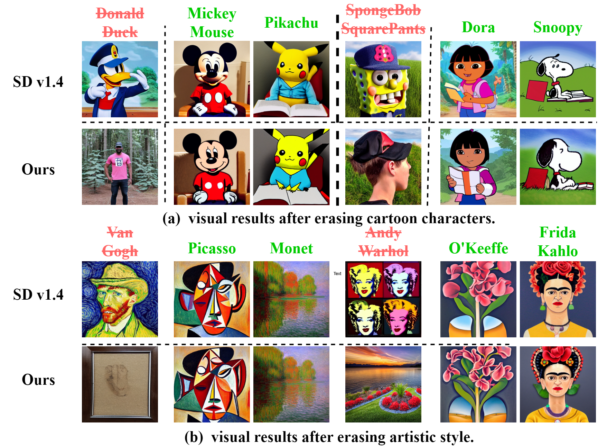
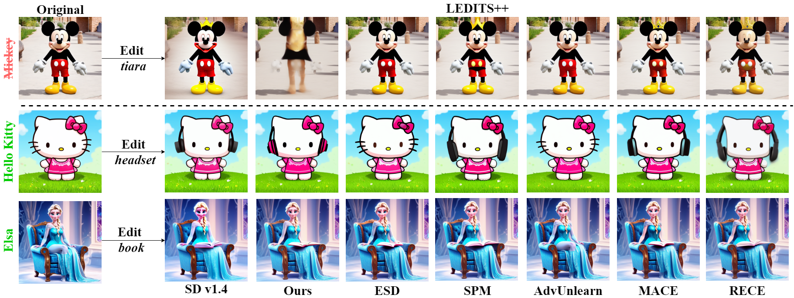

<div align="center">
<h2>ACE: Anti-Editing Concept Erasure in Text-to-Image Models</h2>
<a href="https://arxiv.org/abs/2501.01633"></a>

[Zihao Wang](https://scholar.google.com.hk/citations?user=rNsMDCUAAAAJ&hl=zh-CN)<sup>1</sup> |
[Yuxiang Wei](https://scholar.google.com/citations?user=hORhL7YAAAAJ&hl=en&oi=ao)<sup>1</sup> |
[Fan Li](https://scholar.google.com/citations?hl=en&user=DRnHw6sAAAAJ)<sup>2</sup> |
[Renjing Pei](https://orcid.org/0000-0001-7513-6576)<sup>2</sup> |
[Hang Xu](https://scholar.google.com.hk/citations?user=J_8TX6sAAAAJ&hl=en)<sup>2</sup> |
[Wangmeng Zuo](https://scholar.google.com/citations?user=rUOpCEYAAAAJ&hl=en)<sup>1,3</sup>

<sup>1</sup>Harbin Institute of Technology, <sup>2</sup>Huawei Noah’s Ark Lab, <sup>3</sup>Pazhou Lab (Huangpu)
</div>

:star: This respository contains the code for paper **ACE: Anti-Editing Concept Erasure in Text-to-Image Models.** If ACE is helpful to your images or projects, please help star this repo. Thanks! :hugs:

## Overview Framework

We provide protection against both unconditional noise and conditional noise so that even in editing tasks without target concepts in the input, the generated classifier-free guidance noise can filter out the target concepts that need to be erased.
## Visual Results
### Edit Results

We use [LEDITS++](https://github.com/ml-research/ledits_pp) to evaluate concept erasing effect in edit task.
### Generation Results


### Comparisons with Other Concept Erase Methods


## Dependency Installation
You can create virtual environment use following command.
```bash
git clone https://github.com/120L020904/ACE.git
cd ACE
conda env create -f environment.yaml
```

## Quick Start

### Preparation
First prepare images about test concept, which will be used to calculate the relevance between the testing concept and the erased concept.  
Here, you can also omit entering "is_SD3", change the image size to 512, use SD v1.4 to generate images, in order to speed up the image generation process.
```bash
#! /bin/bash
export CSV="IP_character_50"
export ADD_NAME=""
export OUTPUT_DIR="evaluation-outputs/$CSV$ADD_NAME"
export MODEL_NAME="SD3"
accelerate launch --config_file config.yaml src/generate_images_sd3.py \
  --model_name "${MODEL_NAME}" \
  --prompts_path "data/concept_csv/${CSV}.csv" \
  --save_path="$OUTPUT_DIR" \
  --image_size 1024 \
  --ddim_steps 30 \
  --num_samples 5 \
  --specific_concept_path "data/concept_text/IP_character_50.txt" \
  --is_SD3
```
Running the following command will generate a file storing the relevance scores between the erased concept and the testing concept.
```bash
#! /bin/bash
export CSV="IP_character"
export PRE=""
export ADD_NAME=""
export CSV_FOLDER=$CSV$ADD_NAME
export MODEL="SD3"
CUDA_VISIBLE_DEVICES=0 python src/eval/evaluation/clip_evaluator.py \
  --csv_path="data/concept_csv/$CSV.csv" \
  --save_folder="evaluation-outputs/$CSV_FOLDER/$MODEL" \
  --output_path="evaluation-outputs/$CSV_FOLDER/$MODEL" \
  --num_samples=3 \
  --csv_name="$CSV" \
  --add_name=$ADD_NAME \
  --method "concept_relation" \
  --image_concept_path "data/concept_text/IP_character_concept_10.txt"
```
### Train
Input the file path corresponding to the erased concept obtained in the preparation stage into the "sc_clip_path" parameter. Here, using Elsa as an example, train the concept erasing lora.
```bash
#! /bin/bash
export CONCEPT="Mickey Mouse"
CUDA_VISIBLE_DEVICES=0 python src/lora_train_esd_test.py \
  --prompt "$CONCEPT" \
  --surrogate '' \
  --train_method 'full' \
  --devices '0,0' \
  --iterations 1500 \
  --change_step_rate 1 \
  --lr 0.001 \
  --negative_guidance 3 \
  --surrogate_guidance 3 \
  --ddim_steps 30 \
  --anchor_prompt_path "data/concept_text/IP_character_concept.txt" \
  --anchor_batch_size 2 \
  --pl_weight 0.8 \
  --null_weight 0.99 \
  --sc_clip_path "evaluation-outputs/cartoon_eval_test/SD3/evaluation_results_clip_${CONCEPT}_image_None.json" \
  --is_train_null \
  --with_prior_preservation \
  --no_certain_sur 
```

### Evaluation
The command for test of generating is:
```bash
#! /bin/bash
export CSV="cartoon_eval_format"
export ADD_NAME="_512"
export OUTPUT_DIR="evaluation-outputs/$CSV$ADD_NAME"
export MODEL_NAME="ACE_lora_Mickey Mouse-sc_-ng_3.0-iter_1500-lr_0.001-lora-prior_2_tr_null_True_nc_False_no_cer_sur_True_tensor_False_nw_0.99_pl_0.8_sg_new_3.0_is_sc_clip_True"
accelerate launch --config_file config.yaml src/generate_images_lora.py \
  --model_name "${MODEL_NAME}" \
  --prompts_path "data/concept_csv/$CSV.csv" \
  --generate_concept_path "data/concept_text/IP_character_concept_10.txt"\
  --save_path="$OUTPUT_DIR" \
  --image_size 512 \
  --ddim_steps 30 \
  --num_samples 1 \
  --multipliers 1 \
  --lora_rank 4 \
  --is_lora \
  --lora_name "ACE_lora_Mickey Mouse-sc_-ng_3.0-iter_1500-lr_0.001-lora-prior_2_tr_null_True_nc_False_no_cer_sur_True_tensor_False_nw_0.99_pl_0.8_sg_new_3.0_is_sc_clip_True"

```
The command for test of IP editing is:
```bash
#! /bin/bash
export CSV="IP_character"
export ADD_NAME="_512"
export OUTPUT_DIR="evaluation-outputs/$CSV$ADD_NAME"
export MODEL_NAME="ACE_lora_Mickey Mouse-sc_-ng_3.0-iter_1500-lr_0.001-lora-prior_2_tr_null_True_nc_False_no_cer_sur_True_tensor_False_nw_0.99_pl_0.8_sg_new_3.0_is_sc_clip_True"
accelerate launch --config_file config.yaml src/eval_edit.py \
  --model_name="${MODEL_NAME}" \
  --prompts_path "data/concept_csv/$CSV.csv" \
  --save_path=$OUTPUT_DIR \
  --num_inversion_steps 30 \
  --num_samples 1 \
  --skip 0.1 \
  --edit_guidance_scale 10 \
  --image_size 512 \
  --data_path "evaluation-outputs/${CSV}/SD3" \
  --multipliers 1.0 \
  --inversion_guidance_scale 1.5 \
  --lora_rank 4 \
  --is_SD_v1_4 \
  --use_mask \
  --edit_prompt_path "data/edit_concept/edit_concept_input.csv" \
  --generate_concept_path "data/concept_text/IP_character_concept_10.txt" \
  --is_specific \
  --is_lora \
  --lora_name "${MODEL_NAME}" \
  --is_LEDITS
```
## Checkpoints

Checkpoints are coming soon.


## Acknowledgments

In this code we refer to the following codebase: [Diffusers](https://github.com/huggingface/diffusers) and [SPM](https://lyumengyao.github.io/projects/spm). Great thanks to them!

### Citations
If you like or use our work please cite us:

```
@article{wang2025ace,
  title={ACE: Anti-Editing Concept Erasure in Text-to-Image Models},
  author={Wang, Zihao and Wei, Yuxiang and Li, Fan and Pei, Renjing and Xu, Hang and Zuo, Wangmeng},
  journal={arXiv preprint arXiv:2501.01633},
  year={2025}
}
```
### Contact
If you have any questions, please contact: 24s003077@stu.hit.edu.cn